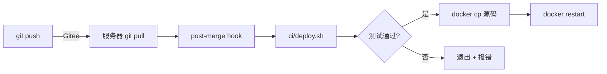

# CI/CD

## 一键安装（新服务器）

```bash
bash <(curl -sL https://gitee.com/MaoZhiqin/video-ai/raw/master/ci/setup.sh)
```

或下载后执行：

```bash
git clone https://gitee.com/MaoZhiqin/video-ai.git
cd video-ai
bash ci/setup.sh
```

`setup.sh` 会自动：
1. 安装 Docker + Docker Compose + Git（如未安装）
2. 克隆项目代码
3. 生成 `.env` 环境变量
4. 启动全部 Docker 服务（PostgreSQL+pgvector, Redis, MinIO, Backend, Frontend）
5. 等待数据库就绪 → 初始化种子数据（admin 用户、默认模板配置）
6. 安装 git hooks（`git pull` 后自动测试+部署）
7. 运行测试验证

## 部署流程



## 服务器日常

```bash
# 拉取最新代码（自动部署）
cd /home/ubuntu/video-ai && git pull origin master

# 仅跑测试
docker exec -w /app video-ai-backend-1 python3 -m pytest tests/studio/ tests/core/ tests/auth/ tests/material/ tests/script/ tests/published/ tests/metrics/ tests/test_coverage_boost.py tests/creation/ -x -q

# 查看服务状态
docker ps

# 查看日志
docker logs -f video-ai-backend-1
```
