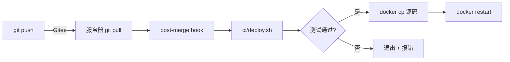

# CI/CD

## 部署流程



## 服务器初始化

首次部署需要在服务器上运行一次：

```bash
# 1. 进入项目目录
cd /home/ubuntu/video-ai

# 2. 安装 git hooks
bash ci/install-hook.sh

# 3. 测试 hook 是否生效
git pull origin master  # 会自动跑测试+部署
```

## 手动部署

```bash
# 服务器上执行
cd /home/ubuntu/video-ai && git pull origin master
```

`post-merge` hook 会自动：
1. 检测变更的文件（`git diff HEAD@{1} --name-only`）
2. 将变更的后端文件 `docker cp` 到容器
3. 运行 pytest
4. master 分支：测试通过后自动 `docker restart`

## 仅跑测试（不部署）

```bash
docker exec -w /app video-ai-backend-1 python3 -m pytest tests/ -x -q
```
# CI/CD deploy test
